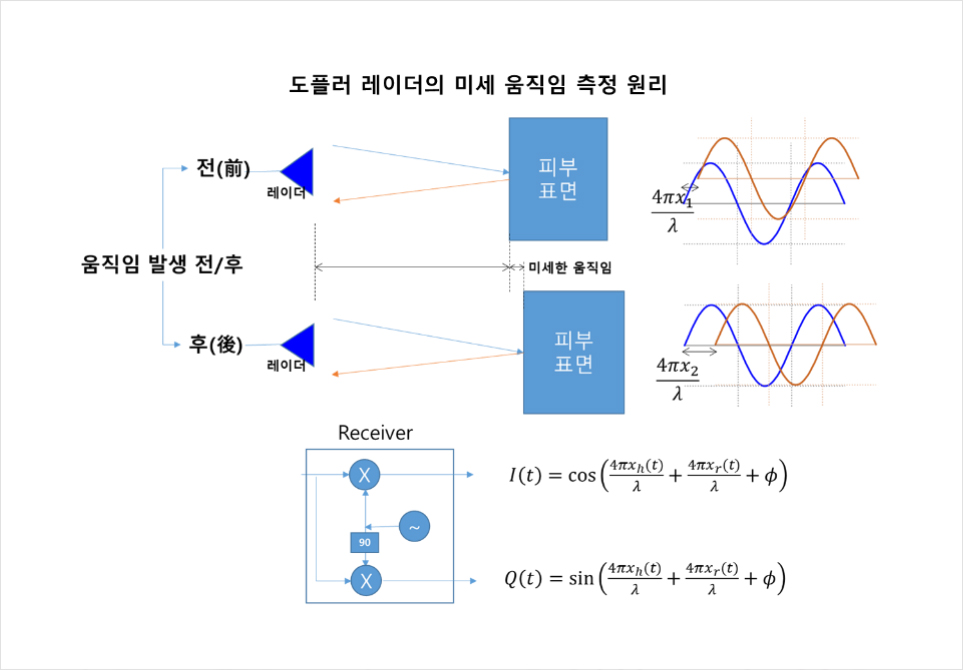

# 레이더란  
레이더는 **RAdio Detection and Ranging** 의 약자로 전파를 사용하여 주변 환경에서 목표물의 거리, 방향, 각도 및 속도를 감지하는 기술이다.  
   

# 종류  
- Continuous Wave(CW) 레이더  
- Frequency Modulated Continuous Wave(FMCW) 레이더  
- 펄스 레이더  
- 기상 레이더  
   

# 적용  
기상 예측, 속도 측정, 장애물 감지, 위치 추적
   

# 원리  

  
    

  

  
    

  

  
